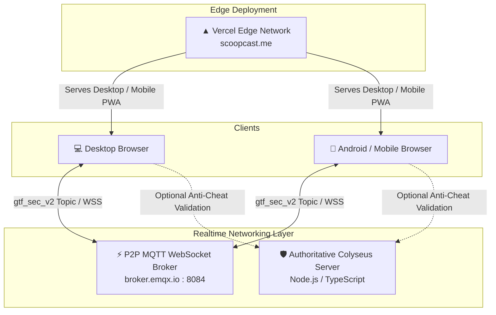

<div align="center">

# 🎬 Scoopcast: Guess The Frame
### The Ultimate Real-Time Multiplayer Cinema Trivia Party Game

[](https://scoopcast.me)
[](LICENSE)
[](CONTRIBUTING.md)
[](#-open-source--codex-program-readiness)
[](https://nodejs.org/)
[](https://www.typescriptlang.org/)

<br />

**[🌐 Play Live on scoopcast.me](https://scoopcast.me)** • **[📱 Android Web App](https://scoopcast.me/android/)** • **[💻 Desktop Experience](https://scoopcast.me/desktop/)** • **[📖 Documentation](#-game-architecture--system-design)**

</div>

---

## 🌟 About Scoopcast: Guess The Frame

**Scoopcast: Guess The Frame** is a modern, open-source party game built for cinephiles, friends, and communities around the globe. Anyone can start a game in seconds without creating an account or downloading an app. Simply share a 4-letter room code, and jump right into a live cinema showdown!

Whether you are on an Android smartphone, an iPhone, a tablet, or a desktop workstation, Scoopcast delivers synchronized real-time trivia across all screens with zero latency.

---

## ✨ Key Features

- 🎮 **Instant Cross-Platform Multiplayer**: Desktop and mobile players join the same rooms seamlessly via a high-speed real-time WebSocket protocol.
- 🎬 **3 Addictive Game Modes**:
  1. **Guess the Frame**: High-resolution cinematic frames from iconic Hollywood, Bollywood, and international masterpieces.
  2. **Guess the Dialogue**: Memorable movie quotes and one-liners that test your recall.
  3. **Guess the Eye**: Intense celebrity eye close-ups with dramatic full-portrait reveals upon answer.
- 🔍 **Smart Fuzzy Match Engine**: Tolerates typos, roman numerals, punctuation differences, and minor spelling mistakes (`FuzzyMatcher` with normalized Levenshtein distance).
- 🧘 **Android Zen Focus Mode**: Automatically hides all header banners, tickers, and HUD clutter whenever you type, giving you 100% uncropped view of the frame directly above your soft keyboard.
- 💡 **Dynamic Masked Hints**: Need help? Unlock a private masked letter hint (`M _ _ _ _ N`) at the cost of -2 points without spoiling the answer for opponents.
- 🛡️ **Cryptographic Network Security**: 32-bit FNV-1a cryptographic room hashing and tamper-proof sender tokens protect games from manipulation.
- 💬 **Live Chat with Anti-Spoiler Shield**: Chat with everyone in the room in real-time. If anyone accidentally types the correct answer into chat, the system blocks the spoiler and converts it to a point-scoring guess!
- 🏆 **Dynamic Podiums & Tie-Breakers**: Live podium animations for 1st, 2nd, and 3rd place with instant tie-breaker rounds if scores are matched.

---

## 🕹️ How to Play

### 1. Starting or Joining a Room
1. Visit **[scoopcast.me](https://scoopcast.me)** on your computer or smartphone.
2. Choose your nickname and pick your favorite avatar (*Aman*, *Amish*, *Aziz*, or *Vish*).
3. **Host a Game**: Click **Create Room** to generate a 4-letter room code (e.g. `RYZQ`).
4. **Join a Game**: Click **Join Room**, enter your friend's 4-letter code, and enter the lobby.
5. The Host selects the category (*All*, *Frames*, *Quotes*, or *Eyes*), number of rounds (10–40), and round timer (15–45s), then hits **Start Match**!

### 2. Scoring System
| Position | Points Awarded | Description |
| :--- | :--- | :--- |
| 🥇 **1st Place** | **+10 PTS** | Fastest correct guess in the room |
| 🥈 **2nd Place** | **+7 PTS** | Second player to guess correctly |
| 🥉 **3rd Place** | **+5 PTS** | Third player to guess correctly |
| 💡 **Hint Used** | **-2 PTS** | Deducted immediately when unlocking the masked hint |

---

## 📐 Game Architecture & System Design

Scoopcast features a **hybrid dual-gateway architecture** engineered for resilience, low-latency, and zero operating costs:



### Architecture Highlights
1. **P2P WebSocket Mesh**: Uses lightweight MQTT over secure WebSockets with deterministic topic hashes (`gtf_sec_v2/{fnv1a_hash}_{roomCode}`).
2. **Deterministic State Synchronization**: The authoritative host broadcasts game state transitions (`ROUND_START`, `GUESS_CORRECT_BROADCAST`, `ROUND_FINISH_BROADCAST`, `GAME_OVER_BROADCAST`).
3. **Colyseus Room Backend**: Included in `guess-the-frame-colyseus/` for dedicated server installations requiring server-side room persistence, Redis clustering, and strict anti-cheat.

---

## 📂 Repository Structure

```text
guess-the-frame/
├── android/                         # Dedicated mobile-first Android build
│   ├── css/
│   │   └── android.css              # Neobrutalist mobile styles & Zen Focus Mode
│   ├── js/
│   │   ├── audio.js                 # Web Audio API sound effects
│   │   ├── gameClient.js            # Realtime MQTT game client & state machine
│   │   ├── haptics.js               # Mobile vibration feedback
│   │   ├── keyboard.js              # Soft-keyboard observer & viewport manager
│   │   ├── mobileUi.js              # Mobile DOM controller & animations
│   │   └── mqtt.min.js              # Bundled standalone MQTT client
│   └── index.html                   # Mobile entrypoint
│
├── desktop/                         # Workstation & desktop browser experience
│   └── index.html                   # Desktop app with full judge & local party modes
│
├── guess-the-frame-colyseus/        # Authoritative backend server
│   ├── src/
│   │   ├── config/gameConfig.ts     # Room timers, scoring & round config
│   │   ├── data/catalog.ts          # Server-side movie & quote catalog
│   │   ├── rooms/TriviaRoom.ts      # Colyseus multiplayer game room logic
│   │   ├── rooms/schema/GameState.ts# Schema state synchronization
│   │   ├── utils/fuzzyMatcher.ts    # Server fuzzy string matcher
│   │   └── index.ts                 # Backend server entrypoint
│   ├── package.json
│   └── tsconfig.json
│
├── GUESSTHEFRAME/                   # Cinema frame media library (WebP)
├── GUESSTHEEYES/                    # Celebrity eye crop & reveal library
├── tie breaker/                     # High-stakes tie-breaker frame library
├── avvtar/                          # Neobrutalist SVG avatars (Aman, Amish, Aziz, Vish)
├── bg/                              # Backgrounds and branding artwork
├── vercel.json                      # Edge routing, redirects & media rewrites
├── test_cross_platform_live.js      # Automated end-to-end multiplayer test suite
└── README.md                        # Documentation
```

---

## 🛠️ Local Development Setup

### Prerequisites
- [Node.js](https://nodejs.org/) version 18.0.0 or higher
- `npm` or `pnpm`

### 1. Clone the Repository
```bash
git clone https://github.com/asmitsharma-alt/scoopcast-guess-the-frame.git
cd scoopcast-guess-the-frame
```

### 2. Run the Frontend Locally
You can serve the project using any static file server:
```bash
# Using npx serve
npx serve .

# Or using Python 3
python -m http.server 3000
```
Open [http://localhost:3000](http://localhost:3000) in your browser.
- Desktop version: `http://localhost:3000/desktop/`
- Mobile version: `http://localhost:3000/android/`

### 3. (Optional) Run the Authoritative Colyseus Backend
```bash
cd guess-the-frame-colyseus
npm install
npm run dev
```
The server will start on `ws://localhost:2567`.

### 4. Run Automated End-to-End Tests
Verify cross-platform communication between simulated Desktop and Android clients over live WebSockets:
```bash
node test_cross_platform_live.js
```

---

## 🤝 Open Source & Codex Program Readiness

**Scoopcast: Guess The Frame** was built from day one to be accessible, hackable, and educational for open-source contributors and mentorship programs (such as GitHub Open Source, Codex, and GSoC).

### 🎯 Contribution Opportunities & Roadmap
- [ ] **Community Movie Packs**: Add categorized movie packs (e.g., Anime, Sci-Fi, 90s Classics, Bollywood, European Cinema).
- [ ] **Multi-Language Support**: Localize UI and movie titles in Spanish, French, Hindi, Japanese, and German.
- [ ] **Custom Room Playlists**: Allow hosts to upload their own frames or paste image URLs for custom trivia nights.
- [ ] **Spectator Mode**: Allow non-participating viewers to watch live matches with real-time emoji reactions.
- [ ] **PWA Offline Mode**: Service Worker caching for instant offline solo practice mode.

See [CONTRIBUTING.md](CONTRIBUTING.md) for step-by-step instructions on submitting issues and pull requests.

---

## 📄 License

This project is open-source and licensed under the [MIT License](LICENSE).

---

<div align="center">

Made with ❤️ by [Asmit](https://github.com/asmitsharma-alt) & the Open Source Community.  
**Grab some popcorn and play at [scoopcast.me](https://scoopcast.me)!** 🍿

</div>
